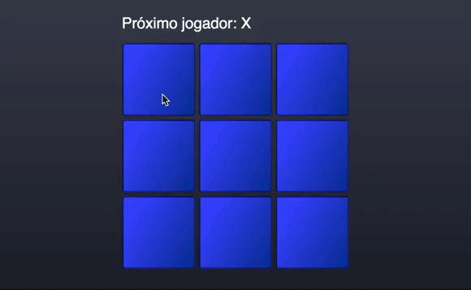

# Hash Game (Jogo da velha)

### Simple hash game with react agains bot

Rules
1. You always plays as circle
2. There's a 50% chance of you starting the game


## Examples



## Install 

```
    cd ~/your-directory
    git clone https://github.com/AbimaelAndrade/react-hash-game.git ./
    npm install    
```

## Execute

To get started developing right away:

start the development server with `npm start`